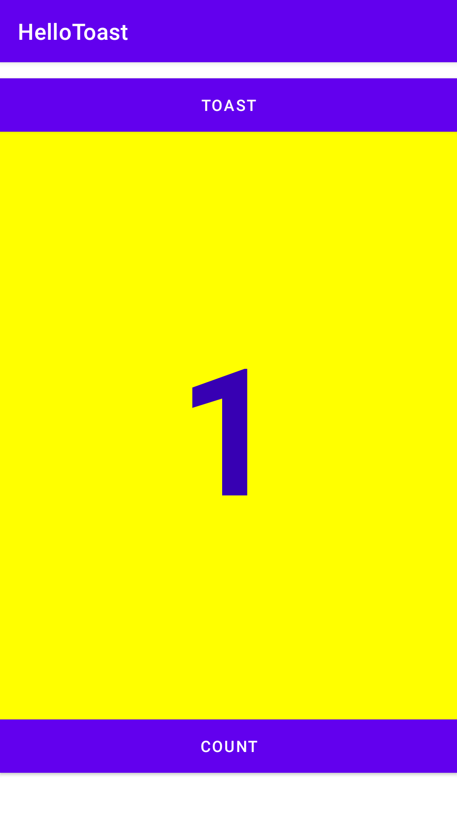
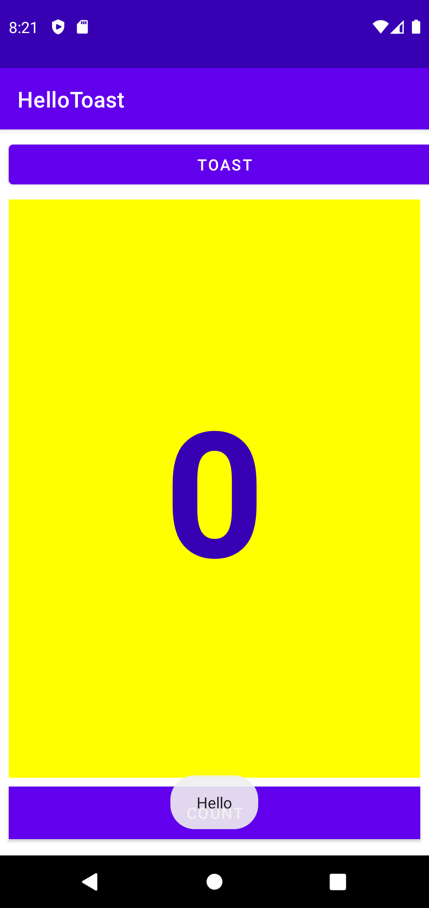
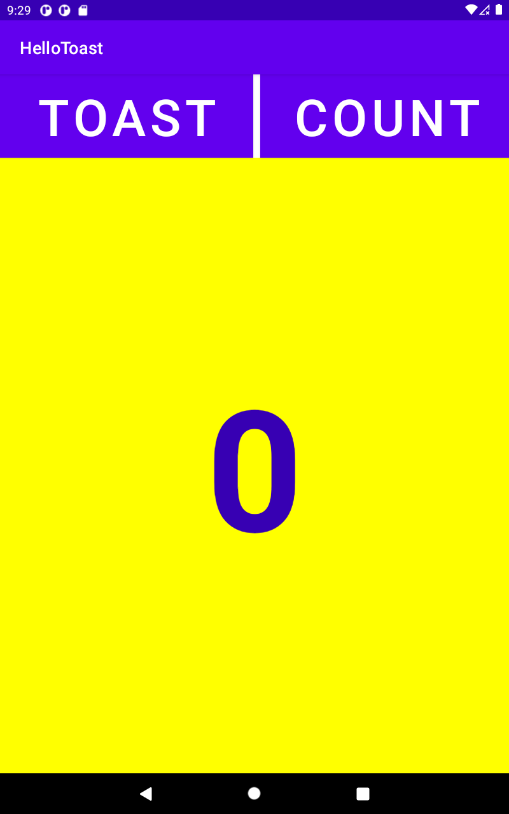
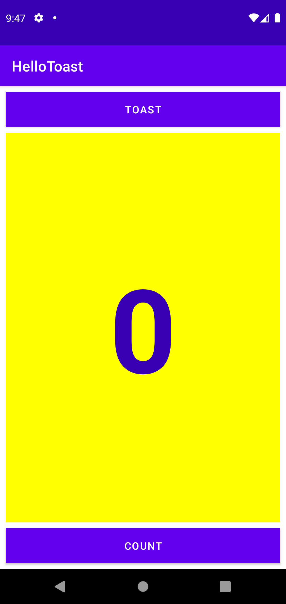
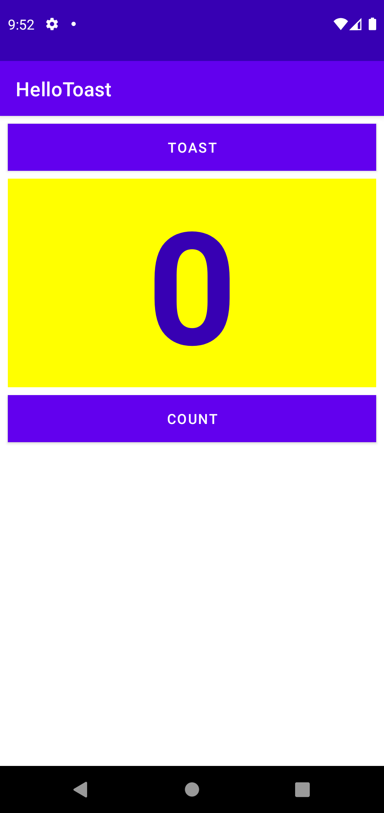

# helloToast

<h2>Screenshot of HelloToast</h2> 

<h2>gif of HelloToast</h2>

<h2>Screenshot after count button is pressed</h2>

<h2>Screenshot when toast button is clicked</h2>

<h2>Screenshot of layout editor: Task 1</h2>

<h2>Screenshot of layout editor: Task 2</h2>

<h2>Screenshot of layout editor: Task 3</h2>

